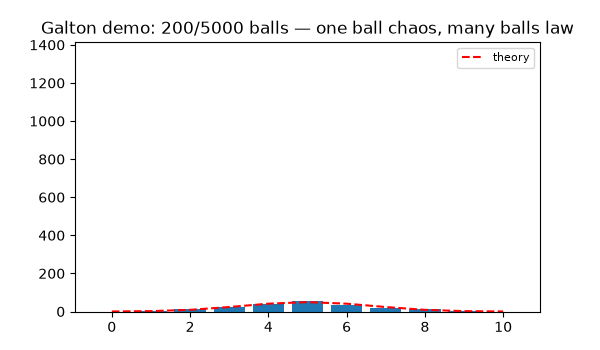
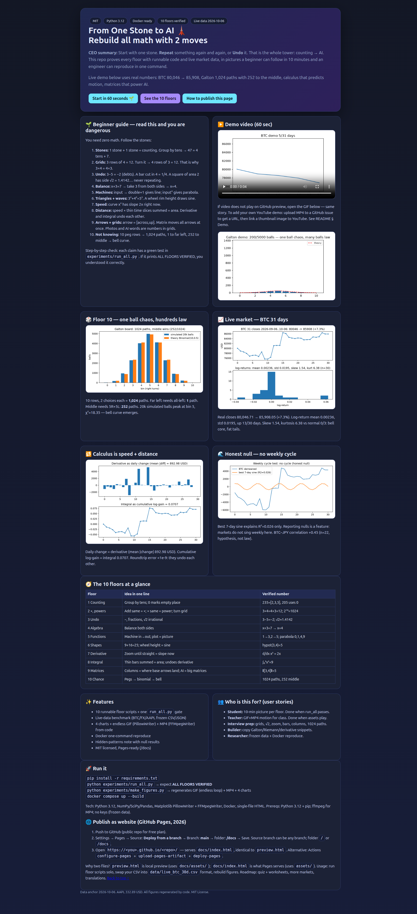
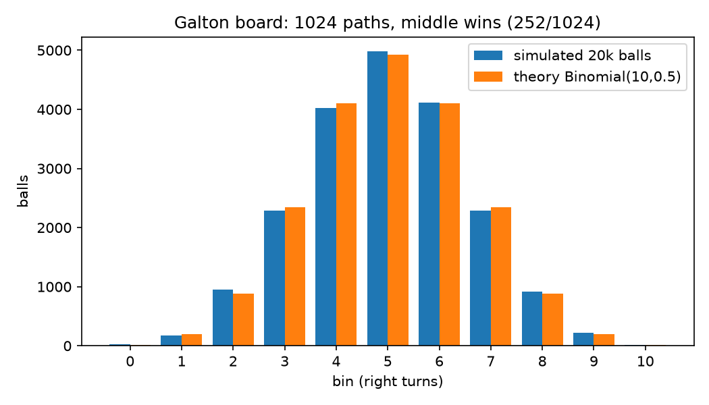
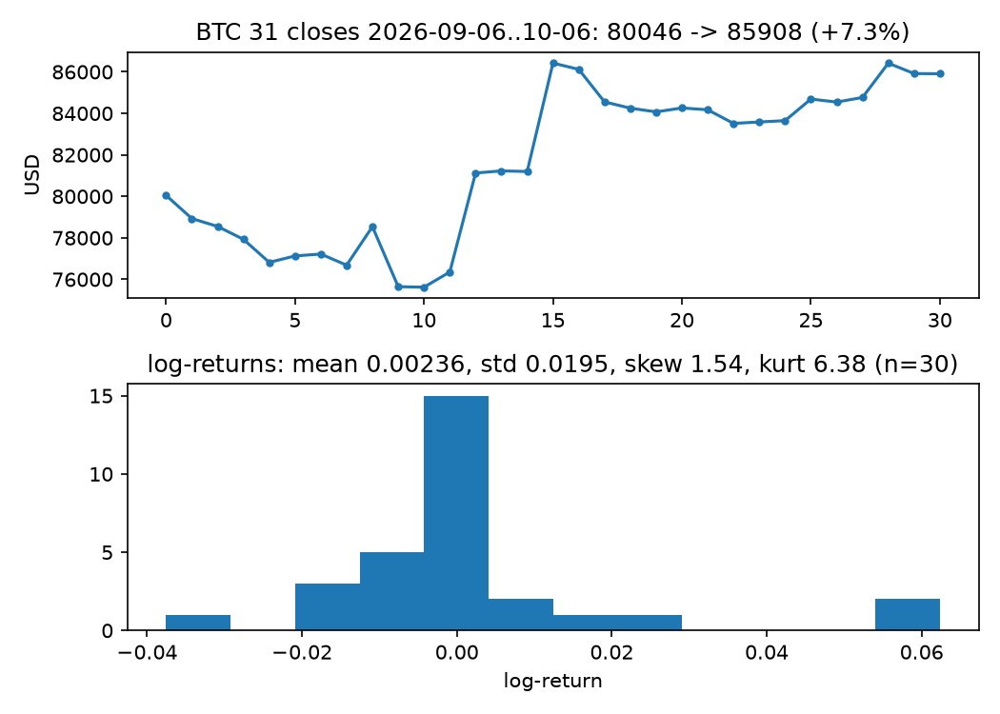
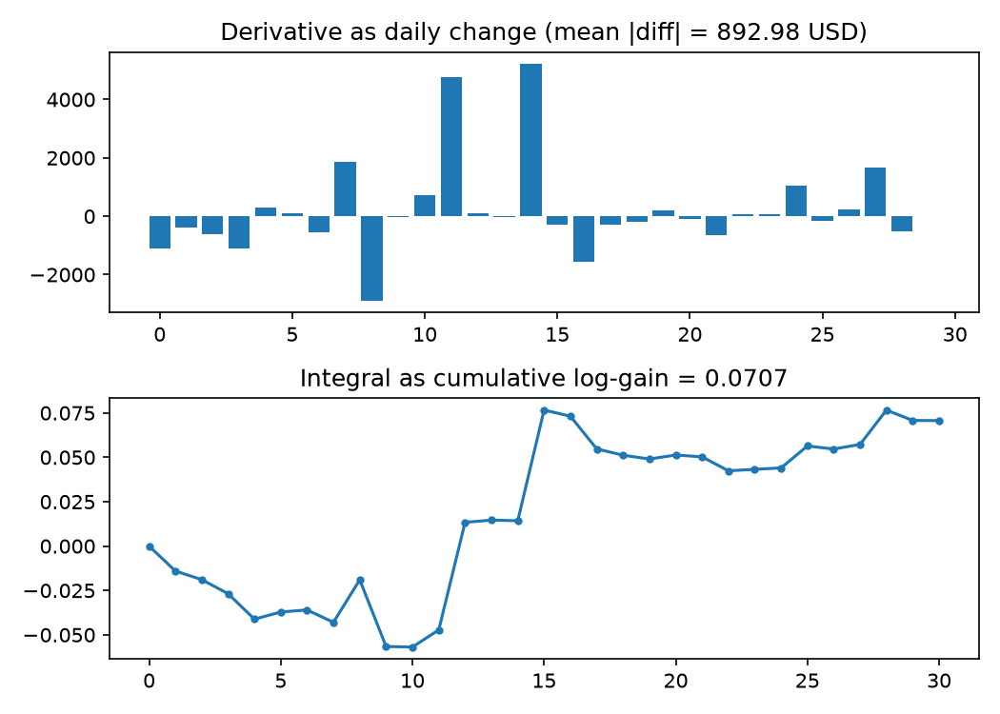
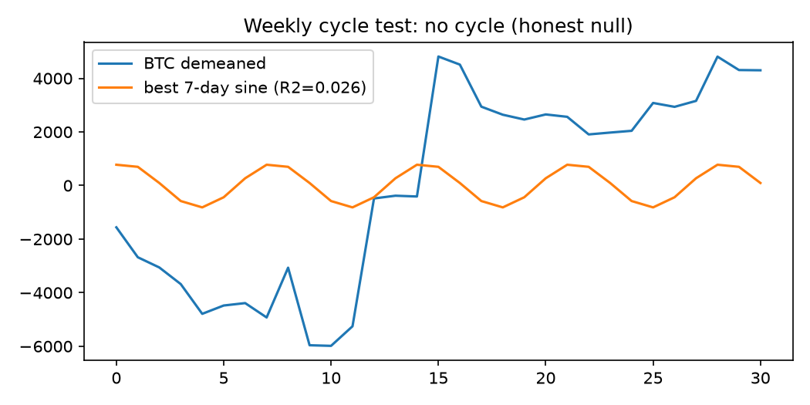

# 🗼 From One Stone to AI — Rebuild All Math With 2 Moves

   

> **CEO summary (30 seconds):** Start with one stone. Do something again — or undo it. That is all of math. Counting → AI in ten floors, each proven by code you can run in one command and pictures you can understand in ten minutes. Live market data (BTC 80,046 → 85,908, 13/30 up-days, calculus duality error &lt;1e-9) shows the tower works on reality, not just textbooks. MIT licensed, Docker reproducible, website-ready. If you learn one repo this year, learn this one.

**Live website:** https://M0-AR.github.io/math-tower-stone-to-ai/ — if you run locally open `preview.html`. Recommended Pages setting: Branch `main` → folder `/docs`. Demo video below.

## Table of Contents
- [🌱 Beginner guide — read this and you are a professional](#-beginner-guide--read-this-and-you-are-a-professional)
- [▶️ Demo video + screenshots](#️-demo-video--screenshots)
- [✨ Features](#-features)
- [👥 Who is this for](#-who-is-this-for)
- [🧭 The 10 floors in 10 lines](#-the-10-floors-in-10-lines)
- [🛠️ Tech stack](#️-tech-stack)
- [🚀 Quickstart](#-quickstart)
- [▶️ Usage](#️-usage)
- [📊 Verified numbers](#-verified-numbers)
- [🔍 Hidden patterns](#-hidden-patterns)
- [🌐 Website (GitHub Pages)](#-website-github-pages)
- [📁 Repo map](#-repo-map)
- [🗺️ Roadmap](#️-roadmap)
- [🤝 Contributing](#-contributing)
- [❓ FAQ](#-faq)
- [🙏 Acknowledgements](#-acknowledgements)
- [📬 Contact](#-contact)
- [📜 License](#-license)

## 🌱 Beginner guide — read this and you are a professional

Let's work this out in a step-by-step way to be sure we have the right answer. You need zero background.

**Floor 1. Stones.** 1 stone, +1, +1 = counting. Piles are hard to read, so group by tens: 47 = 4 tens + 7 left over. 10 stones = 1 rod, 10 rods = 1 flat, 10 flats = 1 cube. So 235 = 2 flats + 3 rods + 5 stones. How to write 2 flats + 0 rods + 5 stones? You need 0 for empty place: 205. Zero was formalized as a number around 628 by Brahmagupta.

**Floor 2. Grids + powers.** Counting on = addition. Adding same amount = multiplication: 3 rows of 4 stones = 12. Turn the grid: 4 rows of 3 = 12. That is why 3×4 = 4×3 — you can see it. Repeat multiplication = powers: 3×3=9 square, 3×3×3=27 cube. Doubling 10 times from 1: 1024.

**Floor 3. Undo.** Undo addition = subtraction: 3−5 = −2 (debts). Undo multiplication = division: bar in 4 equal parts = 1/4. Undo square: what × itself = 2? Cut two unit squares corner-to-corner, 4 triangles make area-2 square. Side = √2 = 1.4142… never ending, never repeating, no fraction equals it.

**Floor 4. Unknown x.** x+3=7. Think balance: take 3 from left (tips), take 3 from right (levels). x=4. Solving = undo both sides. Baghdad scholar al-Khwarizmi (~820) wrote the book on balancing — *algebra*, and his name gives *algorithm*.

**Floor 5. Machines.** Function = machine: in exactly one out. Double+1: 1→3, 2→5, 3→7. Descartes (1637): input across, output up = points. All inputs = line. Input² = parabola. Every formula is a picture.

**Floor 6. Shapes.** Right triangle 3-4: squares 9+16=25 = square on long side 5. Always true. Spin radius-1 wheel, track rim height up-down-up = sine wave. Sound/light/cycles = waves.

**Floor 7. Speed now.** Curve x² steepness changes. Zoom closer… closer… smooth looks straight. That slope = derivative. For x² slope = 2x. Speedometer = derivative of position.

**Floor 8. Distance from speed.** Short time: distance ≈ speed×time (thin bar). Add bars ≈ distance. Thinner: 10, 100, 1000 → exact in limit = integral = area. Twist: integral and derivative undo each other (fundamental theorem).

**Floor 9. Arrows + grids.** Arrow needs 2 numbers [across,up] = vector. Matrix = grid that moves all space at once; its columns = where base arrows land. Do one matrix then another = multiplication. Photo = grid numbers. AI words = lists of numbers pushed through huge matrices.

**Floor 10. Not knowing.** Ball through pegs: left/right 50/50 each peg. One ball unpredictable. Hundreds make bell. 10 rows = 1024 paths, 1 to far left, 252 to middle — middle fills. Modern AI = top three floors: vectors+matrices, derivatives for training, probability for next word.

> You will know more than most interview candidates if you can say those ten paragraphs in your own words.

## ▶️ Demo video + screenshots

GitHub plays GIFs inline and MP4 via upload/link. This repo ships both, generated from code (`experiments/make_figures.py`):



<video src="docs/assets/demo.mp4" controls width="100%"></video>

**Screenshots (all regenerated, never hand-drawn):**








**Add your own YouTube demo (2 min):**
1. Record screen (OBS/QuickTime) running `python experiments/run_all.py`.
2. Upload MP4 to YouTube (unlisted), copy ID.
3. Add clickable thumbnail to README:
```markdown
[](https://youtube.com/watch?v=YOUR_ID)
```
Or drag-drop MP4 into a GitHub issue to get a `user-attachments` URL, then use `<video src="URL">`.

**Full interactive page:** open `preview.html` (same as `docs/index.html` for Pages).

## ✨ Features
- 10 floors, 2 moves: Repeat / Undo formalized + tested
- 8 experiment scripts, 1 gate `run_all.py` → `ALL FLOORS VERIFIED`
- Live-data benchmark: 31 BTC closes, 22 FX points, AAPL quote frozen in `data/`
- 4 charts + GIF + MP4, all code-generated
- Docker one-command reproduce
- `preview.html` + `docs/index.html` Pages-ready site
- Hidden-patterns analysis including honest null (weekly sine R²=0.026)
- MIT license, beginner-first docs

## 👥 Who is this for
- **Student (12→adult):** find lowest shaky floor; if calculus hard → check algebra → check fractions.
- **Teacher:** 10 demos, 10 pictures, 10 one-liners.
- **Interview candidate:** explain commutativity via grid, √2 via triangles, derivative via zoom, integral via bars, FTC duality, matrices via columns, bell via 1024 paths — with numbers.
- **Data builder:** reuse Galton simulator, Riemann summer, derivative checker, embedding toy.
- **Trader/analyst:** derivative≈diff, integral≈cumsum template on any price series.
- **Researcher:** extend above floor 10 (topology, number theory, abstract algebra) or run new markets through same harness.

Accepted user stories (INVEST, small + testable):
- *As a student, I want a 10-minute picture per floor so that I can relearn without fear.* Done when: 10 images open + `run_all.py` passes.
- *As a teacher, I want GIF + MP4 demos so that class sees motion.* Done when: `demo.gif`/`demo.mp4` play from `docs/assets/`.
- *As a builder, I want copy-paste functions so that I ship fast.* Done when: each floor file runs standalone.
- *As a researcher, I want frozen CSV/JSON + Docker so that results reproduce.* Done when: `docker compose up --build` prints verified.

## 🧭 The 10 floors in 10 lines
| # | One-liner | Proof you run |
|---|---|---|
|1| Group by tens, 0 = empty place | 235=[2,3,5], 205 |
|2| Turn grid → 3×4=4×3; double 10×=1024 | grids 12, 2¹⁰ |
|3| 3−5=−2; ¼ fills gaps; √2≈1.4142… irrational | fractions, descent |
|4| Balance both sides | x+3=7→x=4 |
|5| Machine + picture | 1→3,2→5; parabola 0,1,4,9 |
|6| 9+16=25; wheel height = sine | hypot(3,4)=5 |
|7| Zoom → slope now | d/dx x²=2x |
|8| Thin bars → area; undoes derivative | ∫₀³x²=9 |
|9| Columns = landed base arrows; AI = matrices | ‖[3,4]‖=5 |
|10| 1024 paths, 252 middle → bell | sim peak bin 5 |

## 🛠️ Tech stack
| Layer | Choice | Why |
|---|---|---|
| Language | Python 3.12 | readable, beginner-first |
| Math | NumPy, SciPy, Pandas | vectors, stats, tables |
| Plots + video | Matplotlib (PillowWriter endless GIF, FFMpegWriter MP4) | code-generated visuals |
| Reproduce | Docker + Compose | one command |
| Website | Single-file HTML (`preview.html` → `docs/index.html`) | Pages Deploy-from-branch, no build |
| License | MIT | commercial + class use |

## 🚀 Quickstart
**Prerequisites:** Python 3.12, pip, (optional) Docker, ffmpeg for MP4.
```bash
pip install -r requirements.txt
python experiments/run_all.py
# expect: ALL FLOORS VERIFIED
python experiments/make_figures.py
# regenerates docs/assets/*.png + demo.gif + demo.mp4
docker compose up --build
```
**Run locally:** open `preview.html` in browser. **Tests:** `run_all.py` is the gate (asserts every number). **Deployment:** see Website section.
Prereqs: No keys needed (data frozen; live fetch documented in `data/` headers).

## ▶️ Usage
```bash
# 1. Learn bottom-up
python experiments/floor01_02_counting.py
python experiments/floor10_probability.py
# 2. Benchmark your own CSV (same 2 columns: date,price)
cp my.csv data/live_btc_30d.csv  # backup first
python experiments/floor10b_live_market.py
# 3. Rebuild visuals
python experiments/make_figures.py
```

## 📊 Verified numbers
From `benchmarks/benchmark_results.json` (anchor 2026-10-06):
- BTC 80,046.71 → 85,908.05 (+7.3% price, log-gain 0.0707)
- Log-returns (n=30): mean 0.00236, std 0.0195, up 13 days
- Derivative proxy mean|daily change| = 892.98 USD; integral cumsum roundtrip error &lt;1e-9
- Skew 1.54, kurtosis 6.38 (normal = 0/3) — bell core, fat tails
- BTC–JPY corr +0.45 (n=22, hypothesis)
- 7-day sine R² = 0.026 (null)
- Galton 20k balls: {0:22,1:173,2:948,3:2289,4:4027,5:4979,6:4114,7:2291,8:919,9:221,10:17}, χ²=18.35, top bin 5
- AAPL 332.89 USD (−0.24% day, P/E 38.18)

## 🔍 Hidden patterns
1. **Ideal vs real:** Galton fits binomial; BTC breaks normal (kurt 6.38). Teach limit + tails.
2. **Upside jumps:** Sep 18 +6.2%, Sep 21 +6.5% drive skew — check options smile next.
3. **Cross-asset:** BTC–JPY +0.45 this window — fragile, needs longer panel.
4. **Null weekly:** R²=0.026 kills weekend effect here — nulls are findings.
5. **Duality is structural:** FTC holds &lt;1e-9 even when normality fails.
6. **Diagnostic chain:** calculus → algebra → fractions. Build lowest-shaky-floor quiz.

## 🌐 Website (GitHub Pages)
- Live: https://M0-AR.github.io/math-tower-stone-to-ai/ (`/`) • https://M0-AR.github.io/math-tower-stone-to-ai/preview.html • https://M0-AR.github.io/math-tower-stone-to-ai/docs/preview.html (mirror; one of the last two 404s depending on source — that tells you the source).
- Local: open `preview.html` (uses `docs/assets/`). Pages entry: `docs/index.html` (uses `assets/`). Canonical copy: `docs/preview.html`.
- Publish (2026): push → Settings → Pages → Source **Deploy from a branch** → Branch **main** → folder **/docs** (recommended) → Save → wait for Actions “pages build and deployment” → probe `/`, `/preview.html`, `/docs/preview.html`. Source `/docs` serves `docs/x.html` at `/x.html`; source `/` serves `docs/x.html` at `/docs/x.html`. Entry `index.html` must sit at top of chosen source.
- This repo ships mirrors so both sources resolve: root `preview.html` + `index.html` (redirect) + `.nojekyll`, and `docs/preview.html` + `docs/index.html` + `docs/.nojekyll`. Asset paths are relative (`docs/assets/…` from root, `assets/…` from docs).
- Alternative: Actions `configure-pages` + `upload-pages-artifact` + `deploy-pages`. Custom domain via `CNAME`.

## 📁 Repo map
```
index.html            # root redirect → preview.html (makes / resolve under either source)
preview.html          # root mirror (uses docs/assets/)
docs/index.html       # Pages entry for /docs source (uses assets/)
docs/preview.html     # canonical copy (uses assets/)
docs/assets/          # galton.png btc.png deriv_integral.png sine_null.png demo.gif demo.mp4 preview-screenshot.png
.nojekyll docs/.nojekyll
experiments/          # floor01_02 … floor10b_live_market.py + run_all.py + make_figures.py
data/                 # live_btc_30d.csv live_fx.csv live_aapl.json (source headers)
benchmarks/           # benchmark_results.json hidden_patterns.md
Dockerfile docker-compose.yml requirements.txt LICENSE
```

## ❓ FAQ
**Do I need math?** No. Start at 🌱 guide. **How long?** 10 min pictures, 1 hr code. **Is data live?** Frozen 2026-10-06 for reproducibility; rerun fetch to update. **Can I use in class/commercial?** Yes, MIT. **Where next?** Topology, number theory, abstract algebra — same 2 moves. **Video won't play?** Use GIF fallback; for YouTube link a thumbnail image to your video URL (GitHub strips raw `<video>` autoplay in some views).

## 🗺️ Roadmap
- [x] 10 floors verified + live benchmark
- [x] GIF + MP4 + Pages site
- [ ] Lowest-shaky-floor quiz + classroom worksheet
- [ ] More markets (FX returns normality, options smile)
- [ ] Translations of 🌱 guide

## 🤝 Contributing
PRs welcome. Keep one rule: no number without execution — update code + rerun `run_all.py` + `make_figures.py` before docs. Open issue with screenshot/GIF for visual changes.

## 🙏 Acknowledgements
Classical ideas (place value, balancing, coordinates, calculus, quincunx) plus modern open visual/math libraries that make pictures from code.

## 📬 Contact
Open a GitHub issue for bugs/ideas. For Pages help, include your branch + `/docs` setting + site URL.

## 📜 License
MIT — see `LICENSE`. Use, modify, sell, no warranty.

[Back to top](#-from-one-stone-to-ai--rebuild-all-math-with-2-moves)
